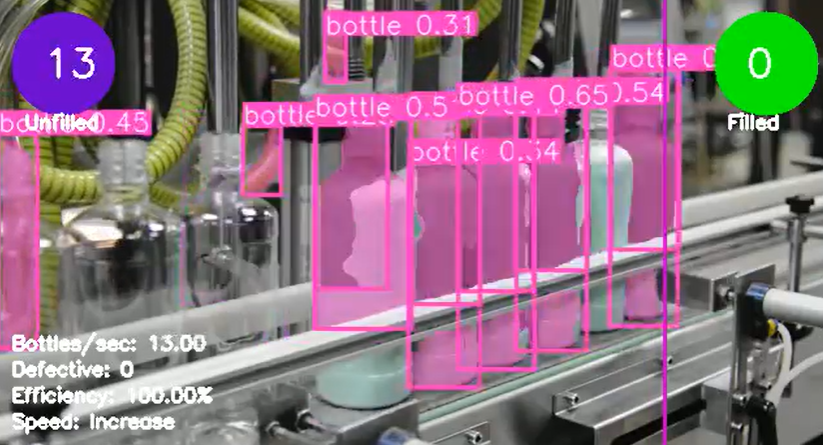

# Bottle Filling Line Automation with Computer Vision

This project implements an automated monitoring system for a bottle filling production line using computer vision techniques. It utilizes the YOLOv8 object detection model to identify and track bottles as they move through the production line, providing real-time analytics and performance metrics.



## Features

1. **Object Detection**: Uses YOLOv8 to detect bottles in each frame of the video feed.
2. **Bottle Counting**: Tracks the number of unfilled and filled bottles.
3. **Production Rate Calculation**: Computes the number of bottles processed per second.
4. **Efficiency Monitoring**: Calculates and displays the production line efficiency.
5. **Defect Detection**: Simulates the detection of defective bottles (for demonstration purposes).
6. **Speed Control Suggestions**: Provides recommendations for adjusting the production line speed based on the current processing rate.
7. **Visual Analytics**: Displays real-time statistics and metrics on the video feed.

## Requirements

````
pip install -r requirements.txt
````